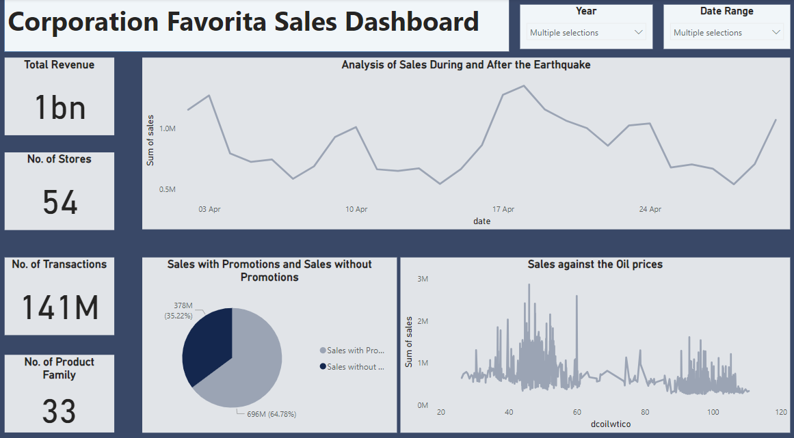
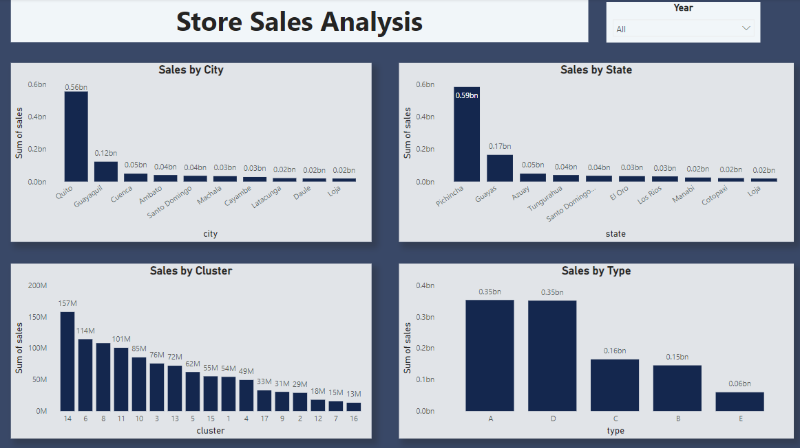
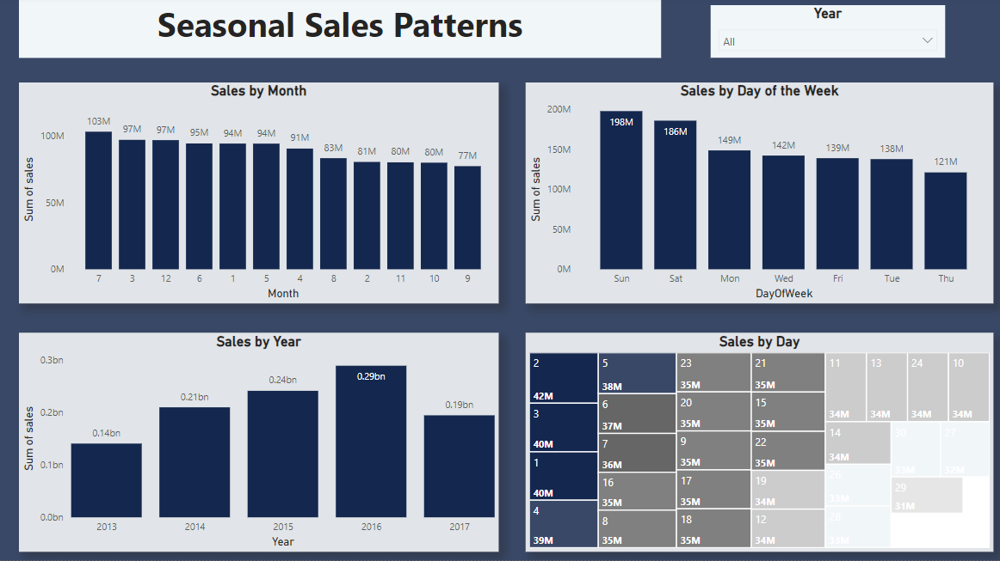
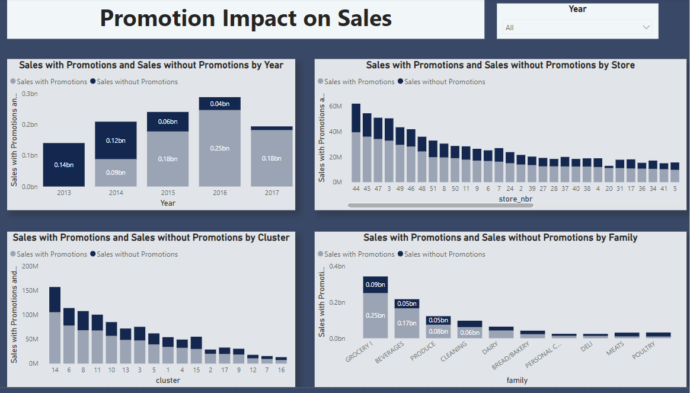

# Time Series Regression Analysis (Corporation Favorita)
### 📗 Table of Contents

- [📗 Table of Contents](#-table-of-contents)
- [Time Series Regression Analysis](#time-series-regression-analysis)
- [Project Description](#project-description)
- [Summary](#summary)
- [EDA](#eda)
- [Introduction](#introduction)
- [Data Understanding](#data-understanding)
- [Business Questions](#business-questions)
- [Hypothesis](#hypothesis)
- [Modeling and Evaluation](#modeling-and-evaluation)
- [Conclusion](#conclusion)
- [👥 Authors](#-authors)
- [⭐️ Show your support](#️-show-your-support)
- [🙏 Acknowledgments](#-acknowledgments)
- [📝 License](#-license)


---

### Project Description

Time series forecasting is crucial for retail, enabling businesses to make informed decisions based on future predictions. This project aims to build a model to predict store sales using data from Corporation Favorita, a large Ecuadorian grocery retailer. Through exploratory data analysis, handling missing data, addressing outliers, managing imbalanced data, and encoding categorical variables, we prepare the data for modeling. Employing statistical models (SARIMA, ARIMA, Prophet) and machine learning models (XGBoost, Linear Regression), we aim to accurately forecast unit sales across Favorita stores, enhancing inventory management and operational efficiency. Model performance is evaluated using Mean Absolute Error (MAE), Root Mean Squared Error (RMSE), and Root Mean Squared Logarithmic Error (RMSLE) to ensure reliable sales forecasts.

---

### Summary
| Project Code | Project Name | Published Article | Power BI Dashboard |Libraries Used|
|--------------|--------------|-------------------|-----------------|--------------|
| LP3          | Time <br> Series <br> Regression <br> Analysis <br> Corporation <br> Favorita| [Medium <br> Article](https://medium.com/@vezabuku/enhancing-inventory-management-with-time-series-sales-forecasting-a-data-science-approach-22525df902a4) | [PowerBI <br>](https://app.powerbi.com/groups/me/reports/0d057587-30b4-4368-ac13-f58de93d87b0/ReportSection?experience=power-bi)|Pandas <br> Polars <br> Numpy <br> Matplotlib <br> Seaborn <br> Pmdarima <br> Sklearn|

---

### Exploratory Data Analysis (EDA)
Exploratory Data Analysis (EDA) plays a vital role in understanding and extracting insights from datasets. It allows us to uncover patterns, relationships, and key characteristics of the data. The main objective of this project is to utilize the CRISP-DM framework as a guiding framework for conducting exploratory data analysis (EDA) and extracting valuable insights. The Cross Industry Standard Process for Data Mining (CRISP-DM) is a process model that serves as the base for data processing.

---

### Introduction

The analysis was performed using the Python programming language and popular libraries such as Polars, Pandas, NumPy, Seaborn, Sklearn and Matplotlib. These libraries facilitated various analysis tasks, including examining individual variables, exploring relationships between variables, analyzing correlations, handling duplicate and missing data as well as the modeling process.

The analysis was conducted in a Jupyter Notebook environment, which allowed for an interactive and organized workflow. Standard EDA procedures were followed, including assessing data quality, performing descriptive statistics, and creating visualizations.

The dataset was explored to understand its structure, check for missing or duplicated data, and convert variables to appropriate formats when necessary. Descriptive statistics provided a summary of the data, allowing for an understanding of the central tendencies, variations. Visualizations, such as kde plots, box plots and scatter plots were created to identify patterns, trends, and relationships between variables. The analysis also involved examining the relationship between sales and other variables.

##### Install Packages

Here, you need to recursively install the packages in the `requirements.txt` file using the command below 

```sh
   pip install -r requirements.txt
```

##### Imported libraries
To begin the analysis, I started by importing the necessary libraries and packages that will be used throughout the process. These libraries include:
- Polars, Pandas and Numpy: for data cleaning and manipulation
- Matplotlib, Seaborn and Plotly: for visualizations
- Dotenv: for importing environmental variables
- Mann Whitney and Fishers_exact: for Hypothesis testing
- Pmdarima and Sklearn: for Modeling

---

### Data Understanding

File Descriptions and Data Field Information

- train.csv: Time series data of features (store_nbr, family, onpromotion) and target (sales).
- store_nbr: Store identifier.
- family: Product type.
- sales: Total sales for a product family at a store on a given date.
- onpromotion: Total number of items in promotion for a product family at a store on a given date.

test.csv: Similar features as the training data. Used to predict sales for 15 days after the last date in train.csv.

transaction.csv: Contains date, store_nbr, and transaction data.

sample_submission.csv: Sample submission format.

stores.csv: Store metadata (city, state, type, cluster).

oil.csv: Daily oil prices.

holidays_events.csv: Holidays and events metadata.

---

### Business Questions

1. Is the train dataset complete (all required dates included)?
2. Which dates have the lowest and highest sales for each year (excluding store closure days)?
3. Compare monthly sales across years to identify the month with the highest sales.
4. Did the earthquake impact sales?
5. Are certain stores or groups selling more products?
6. Are sales affected by promotions, oil prices, and holidays?
7. What insights can be derived from date-related features?
8. Which product families and stores are affected by promotions?
9. Differences between RMSLE, RMSE, and MSE, and why MAE might be greater than them?
10. Does the payment of public sector wages on the 15th and last days of the month influence store sales?

---
### Power BI Dashboard









---

#### Hypothesis

I developed a hypothesis statement to better help understand the sales behavior in relation to other variable as stated below;

Null Hypothesis (Ho): Holidays do not significantly affect sales.

Alternate Hypothesis (Ha): Holidays significantly affect sales.

---

### Modeling and Evaluation

During the time series forecasting project, I employed a combination of both statistical and machine learning models to predict sales. The statistical models included SARIMA and ARIMA, while the machine learning models included XGBoost and Linear Regression. Additionally, I used Prophet for capturing seasonality and trend components.

---

### CONCLUSIONS

The analysis of Corporation Favorita’s sales data has provided valuable insights into factors affecting sales performance. By implementing the recommendations, the company can optimize inventory management, improve sales performance during key periods, allocate resources more effectively, and plan strategic promotional activities. These actions will lead to better operational efficiency and overall business success.


#### 👥 Authors

Adiru Valiant Ezabuku

Email: vezabuku09@gmail.com

Linkedin Account: [Linkedin](https://www.linkedin.com/in/valiant-ezabuku/)

#### ⭐️ Show your support

If you like this project kindly show some love, give it a 🌟 **STAR** 🌟

#### 🙏 Acknowledgments

I extend my heartfelt thanks to all my tutors at Azubi Africa and my dedicated team members for their guidance, support, and hard work throughout this project. Their expertise, insights, and collaboration significantly contributed to shaping the analysis and outcomes.

#### 📝 License

This project is [MIT](./LICENSE) licensed.

